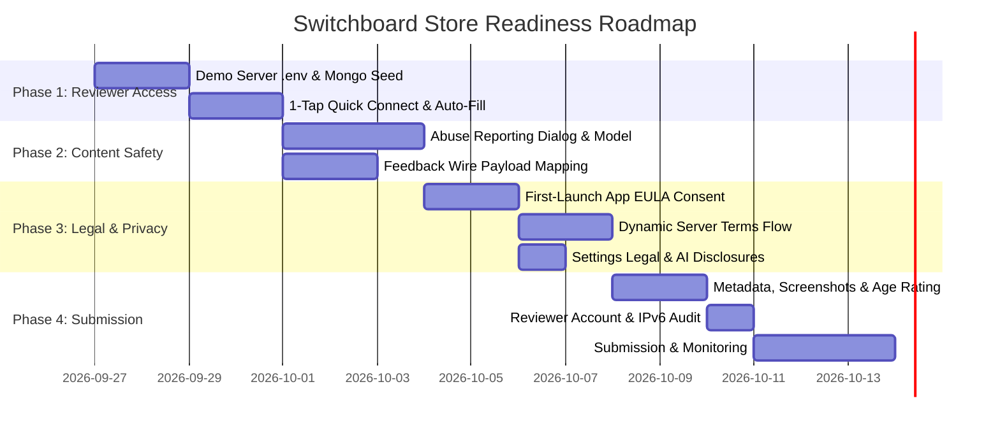

# Constitution: Store Readiness Roadmap

This living roadmap organizes the required tasks into sequential phases following the Spec-Driven Development lifecycle.

---

## Phase 0: Baseline Audit & Gap Resolution (Completed)
- [x] Comprehensive review of Apple Review Guidelines & Google Play GenAI policies (September 2026).
- [x] Full codebase audit of `Librechat-Mobile` (`Switchboard`) and `LibreChat` backend.
- [x] Resolution of API gaps: feedback payload wire shape, dual-tier legal flow, and upstream mirror integrity.

## Phase 1: Reviewer Access & Zero-Friction Demo Mode
*Target Spec*: [`spec-01-reviewer-access-and-demo-mode.md`](../specs/spec-01-reviewer-access-and-demo-mode.md)
- [ ] Configure demo server environment (`ALLOW_REGISTRATION=false`, `ALLOW_EMAIL_LOGIN=true`, `ALLOW_SOCIAL_LOGIN=false`, `ALLOW_ACCOUNT_DELETION=true`, `OPENAI_MODERATION=true`).
- [ ] Seed reviewer account (`appreview@switchboard.chat`) in MongoDB with markdown, Mermaid, Artifacts, and LaTeX conversations.
- [ ] Add `DemoServerConstants` to `core/common/Constants.kt`.
- [ ] Add "Explore with Demo Server" on `ServerUrlScreen.kt` and auto-fill / single-tap reviewer credentials on `LoginScreen.kt`.

## Phase 2: AI Content Flagging & In-App Reporting
*Target Spec*: [`spec-02-ai-content-flagging-reporting.md`](../specs/spec-02-ai-content-flagging-reporting.md)
- [ ] Implement `ReportReason` enum in `feature/chat` (without mutating `FeedbackTag.kt` to preserve `mirrors.json` parity).
- [ ] Add "Report Inappropriate Content" menu item to `MessageContentAndActions.kt`.
- [ ] Implement `ReportMessageDialog.kt` with categories and character limit.
- [ ] Wire reporting submission to `POST /api/messages/{conversationId}/{messageId}/feedback` mapped to `{ rating: 'thumbsDown', tag: 'other', text: '[REPORT: ...]' }`.
- [ ] Verify non-blocking fallback on network or backend error.

## Phase 3: Legal Disclosures, Two-Tier EULA & Terms
*Target Spec*: [`spec-03-eula-terms-privacy-compliance.md`](../specs/spec-03-eula-terms-privacy-compliance.md)
- [ ] Implement `isAppEulaAccepted` and `setAppEulaAccepted` in `SettingsDataStore.kt`.
- [ ] Present `AppEulaBottomSheet.kt` on clean install before proceeding past `ServerUrlScreen`.
- [ ] Connect existing `TermsScreen.kt` and `TermsViewModel.kt` to post-login flow when server requires `modalAcceptance`.
- [ ] Expand `SettingsScreen.kt` with "Legal & About" showing Switchboard EULA/Privacy and dynamic server policies from `startupConfig.interface`.
- [ ] Add AI Data Handling Disclosure dialog detailing upstream LLM routing.

## Phase 4: Authentication Hardening & Apple Sign-In Guard
*Target Spec*: [`spec-04-auth-and-social-login-guard.md`](../specs/spec-04-auth-and-social-login-guard.md)
- [ ] Verify demo server operates with email/password only, ensuring Guideline 4.8 is not triggered during review.
- [ ] Update `LoginScreen.kt` to position "Continue with Apple" at the top of social logins with official Apple HIG styling when present in `socialLogins`.
- [ ] Validate end-to-end account deletion via `SettingsViewModel.deleteAccount()` against demo backend.

## Phase 5: Store Metadata, Trademarks & Submission
*Target Spec*: [`spec-05-metadata-and-branding.md`](../specs/spec-05-metadata-and-branding.md)
- [ ] Finalize App Store Connect & Google Play Console listings as "Switchboard - Client for LibreChat".
- [ ] Add mandatory non-affiliation disclaimer prominently at top of store descriptions.
- [ ] Complete Content Rating / IARC questionnaires targeting 17+ (Apple) and Teen / Mature (Google).
- [ ] Execute `curl -6` IPv6 audit against demo backend.
